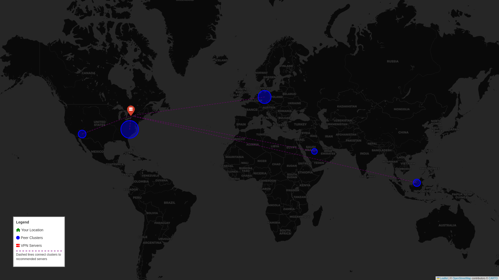

# qBittorrent Peer-IP Clustering & ProtonVPN Server Recommender

<div align="center">

[](https://github.com/tahmidul612/qbScripts/releases)
[](https://www.python.org)
[](LICENSE)
[](https://github.com/astral-sh/ruff)

[](https://www.qbittorrent.org/)
[](https://protonvpn.com/)
[](https://pytest.org)

</div>

A Python tool that analyzes qBittorrent peer distributions and recommends optimal ProtonVPN P2P servers based on geographic clustering.

## Table of Contents

- [Table of Contents](#table-of-contents)
- [Quick Start](#quick-start)
- [Features](#features)
- [Installation](#installation)
  - [Using uv (Recommended)](#using-uv-recommended)
  - [Using pip](#using-pip)
  - [PNG Export Setup (Optional)](#png-export-setup-optional)
- [Usage](#usage)
  - [Basic Usage](#basic-usage)
  - [With Map Generation](#with-map-generation)
  - [With Map and PNG Export](#with-map-and-png-export)
  - [Advanced Options](#advanced-options)
  - [Options](#options)
  - [Example Output](#example-output)
- [Requirements](#requirements)
- [Development](#development)
  - [Setup Development Environment](#setup-development-environment)
  - [Run Tests](#run-tests)
  - [Run Tests with Coverage](#run-tests-with-coverage)
  - [Linting](#linting)
- [Project Structure](#project-structure)
- [How It Works](#how-it-works)
  - [Geolocation Features](#geolocation-features)
- [Contributing](#contributing)
  - [Commit Messages](#commit-messages)
  - [Branch Naming](#branch-naming)
  - [Pre-commit Hooks](#pre-commit-hooks)
- [License](#license)
- [Acknowledgments](#acknowledgments)

## Quick Start

Get up and running in 3 steps:

```bash
# 1. Clone and install
git clone https://github.com/tahmidul612/qbScripts.git
cd qbScripts
uv sync

# 2. Make sure qBittorrent Web UI is enabled (default port 8080)

# 3. Run the analyzer
qb-peer-vpn --username admin --password yourpassword --map peer_map.html
```

That's it! You'll see peer analysis, cluster recommendations, and an interactive map.

<div align="center">
  
  <p><em>Real-time peer geolocation, clustering analysis, and ProtonVPN server recommendations with rich terminal UI</em></p>
</div>

## Features

- 🌍 **Peer Analysis**: Fetch and geolocate all peers from active qBittorrent torrents
- 📊 **Geographic Clustering**: Group peers by location using K-means clustering
- 🔐 **VPN Recommendations**: Suggest optimal ProtonVPN P2P servers for each cluster
- 🎨 **Rich Terminal UI**: Beautiful terminal output with tables, colors, and progress indicators
- 🗺️ **Interactive Maps**: Generate HTML maps visualizing peers and servers
- 🖼️ **PNG Export**: Render maps as static PNG images for easy sharing
- ⚡ **Fast & Cached**: IP geolocation with TTL caching to minimize API calls
- 🚀 **Batch Processing**: Parallel geolocation using batch API endpoints (up to 100 IPs per request)
- 🛡️ **Fallback Providers**: Multiple geolocation providers (IP-API.com, ipapi.co, freeipapi.com) for reliability

## Installation

### Using uv (Recommended)

```bash
git clone https://github.com/tahmidul612/qbScripts.git
cd qbScripts
uv sync
```

### Using pip

```bash
pip install -e .
```

### PNG Export Setup (Optional)

To use the `--render-png` option for generating PNG snapshots of maps, install Playwright and Firefox:

```bash
pip install playwright
playwright install firefox
```

This enables headless browser rendering for converting HTML maps to PNG images.

## Usage

### Basic Usage

```bash
qb-peer-vpn --username admin --password yourpassword
```

### With Map Generation

```bash
qb-peer-vpn --username admin --password yourpassword --map peer_map.html
```

### With Map and PNG Export

Generate both HTML and PNG versions of the map:

```bash
qb-peer-vpn --username admin --password yourpassword --map peer_map.html --render-png
```

This will create:

- `peer_map.html` - Interactive HTML map
- `peer_map.png` - Static PNG snapshot (1920x1080)

### Advanced Options

```bash
qb-peer-vpn \
  --host localhost \
  --port 8080 \
  --username admin \
  --password yourpassword \
  --clusters 7 \
  --map output.html \
  --render-png \
  --theme dark
```

### Options

- `--host`: qBittorrent host address (default: localhost)
- `--port`: qBittorrent port number (default: 8080)
- `--username`: qBittorrent Web UI username (default: admin)
- `--password`: qBittorrent password (prompted if not provided)
- `--clusters`: Number of peer clusters to create (default: 5)
- `--map`: Generate HTML map to specified file
- `--render-png`: Also render the HTML map as a PNG image (requires Playwright)
- `--theme`: Map theme - light or dark (default: light)

### Example Output

<div align="center">
  
  <p><em>Generated interactive map displaying geolocated peers (color-coded by cluster) and recommended ProtonVPN P2P servers</em></p>
</div>

## Requirements

- Python 3.11+
- qBittorrent with Web UI enabled
- Internet connection for IP geolocation and VPN server data

## Development

### Setup Development Environment

```bash
uv sync --dev
pre-commit install
```

### Run Tests

```bash
uv run pytest
```

### Run Tests with Coverage

```bash
uv run pytest --cov=src/qb_peer_vpn --cov-report=term-missing
```

### Linting

```bash
uv run ruff check .
uv run ruff format .
```

## Project Structure

```text
qbScripts/
├── src/qb_peer_vpn/
│   ├── __init__.py
│   ├── cli.py              # Command-line interface
│   ├── peer_fetcher.py     # qBittorrent peer data fetching
│   ├── geolocator.py       # IP geolocation with caching
│   ├── vpn_data.py         # ProtonVPN server data
│   ├── cluster_analyzer.py # Geographic clustering & recommendations
│   ├── ui.py               # Terminal UI with Rich
│   └── map_visualizer.py   # Interactive map generation
├── tests/
│   ├── test_peer_fetcher.py
│   ├── test_geolocator.py
│   ├── test_vpn_data.py
│   └── test_cluster_analyzer.py
├── docs/
├── pyproject.toml
└── README.md
```

## How It Works

1. **Connect to qBittorrent**: Fetches peer data from all active torrents
1. **Batch Geolocate Peers**: Uses IP-API.com batch endpoint (up to 100 IPs per request) with automatic fallback to alternative providers (ipapi.co, freeipapi.com) for failed lookups
1. **Cluster Analysis**: Groups peers geographically using K-means clustering
1. **Server Matching**: Recommends ProtonVPN P2P servers closest to each cluster
1. **Display Results**: Shows recommendations in a rich terminal UI with progress indicators and optionally generates an interactive map

### Geolocation Features

- **Batch Processing**: Processes up to 100 IP addresses per request using IP-API.com's batch endpoint
- **Rate Limiting**: Respects API rate limits (15 requests/minute for batch endpoint)
- **Caching**: TTL-based caching minimizes redundant API calls
- **Fallback Providers**: Automatically falls back to ipapi.co and freeipapi.com if primary provider fails
- **Parallel Requests**: Uses thread pool for concurrent fallback requests
- **Progress Tracking**: Real-time progress indicators during geolocation process

## Contributing

Contributions are welcome! Please follow these guidelines:

### Commit Messages

We use [Conventional Commits](https://www.conventionalcommits.org/):

- `feat:` - New features
- `fix:` - Bug fixes
- `docs:` - Documentation changes
- `style:` - Code style changes (formatting, etc.)
- `refactor:` - Code refactoring
- `test:` - Adding or updating tests
- `chore:` - Maintenance tasks

### Branch Naming

- `feat/feature-name` - For new features
- `fix/bug-name` - For bug fixes
- `docs/doc-name` - For documentation

### Pre-commit Hooks

The project uses pre-commit hooks for:

- Ruff linting and formatting
- Conventional commit message validation

## License

MIT License - see LICENSE file for details

## Acknowledgments

- [IP-API.com](https://ip-api.com/) for free IP geolocation with batch endpoint support
- [ipapi.co](https://ipapi.co/) for fallback geolocation service
- [FreeIPAPI](https://freeipapi.com/) for additional fallback geolocation
- [ProtonVPN](https://protonvpn.com/) for VPN services
- [Huzky-v's ProtonVPN Server List](https://github.com/huzky-v/proton-vpn-server-list) for server data
- [qBittorrent](https://www.qbittorrent.org/) for the excellent torrent client
